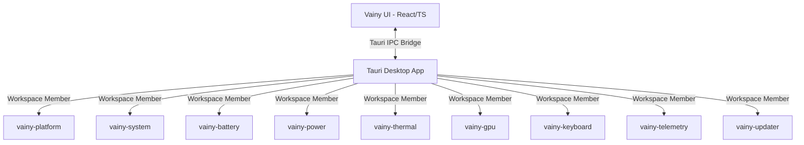

# Vainy Architecture

Vainy is built with a decoupled, modular architecture combining a performant Rust backend and a lightweight, responsive React frontend via Tauri v2.

## Component Overview

## Backend Modules (Rust Workspace)

Each module under `crates/` is independent and communicates with the system through standard Linux kernel and D-Bus interfaces.

1. **`battery`**: Interacts with `/sys/class/power_supply/BAT*` to manage conservation modes, thresholds, and view capacity/wear logs.
2. **`gpu`**: Interfaces with `nvidia-smi` and `switcheroo-control` for dedicated and hybrid graphics toggles.
3. **`thermal`**: Queries sensors via `lm-sensors` and controls platform fan cooling profiles.
4. **`power`**: Communicates with `power-profiles-daemon` and `platform_profile` ACPI nodes.
5. **`keyboard`**: Locates hardware led classes (`/sys/class/leds/lenovo::kbd_backlight`) to manage RGB.
6. **`system`**: Decodes BIOS and DMI motherboard metrics via `/sys/class/dmi/id/`.
7. **`telemetry`**: Background thread monitoring with extremely low RAM usage (< 50MB) and CPU (< 1%).
8. **`updater`**: Standard security checks and modular updater.
9. **`platform`**: Low-level kernel interface dispatcher.

## Frontend Architecture (React 19)

- **Vite & TS**: Fast builds and compile-time type-safety.
- **Zustand**: Single-source-of-truth state management for active pages, power toggles, and rolling diagnostics.
- **Tailwind CSS v4**: CSS-first layout rules utilizing CSS variables for cohesive glassmorphic theming.
- **Motion**: Core page transitions and indicator shifts.
- **uPlot / Sparklines**: Ultra-lightweight chart renderings.
